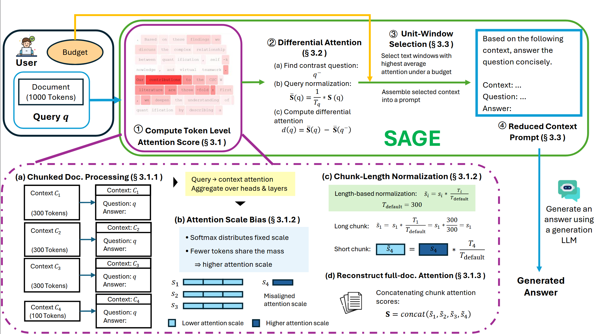

# SAGE: Selective Attention-Guided Extraction for Token-Efficient Document Indexing

This repository contains the official implementation of **SAGE** for our VLDB submission, *Selective Attention-Guided Extraction for Token-Efficient Document Indexing*. SAGE is a training-free, plug-and-play context reduction framework for long-document question answering. Given a document, a query, and a user-defined token budget, SAGE extracts the most informative spans and forwards only the reduced context to a downstream generation model.

SAGE is designed for the common setting of answering many heterogeneous questions over long academic, technical, and policy documents, where passing the full document is expensive and often unnecessary. Instead of relying on embedding-based retrieval alone, SAGE uses query-aware attention signals from a lightweight local LLM to build a relevance heatmap, applies differential attention to reduce structural noise, and selects the best text spans under a strict token budget.

## Repository Purpose

The repository provides:

- the end-to-end implementation of the **SAGE pipeline**
- dataset-specific support for **Paper**, **Notice**, **QuALITY-hard**, and **AIT-QA**
- **baseline implementations** for comparison
- **evaluation code** using either LLM-based judging or cosine similarity
- **analysis scripts** for comparing SAGE against baselines

All main SAGE code is located in the `system/` folder.

## Pipeline Overview

The overall SAGE workflow is shown below:

  

The pipeline consists of four primary stages.  
**Stage 1:** Attention computation utilizes chunked processing and length normalization to form a document-level score.  
**Stage 2:** Differential attention refines relevance by filtering structural noise.  
**Stage 3:** Unit-window selection extracts top text spans under the budget.  
**Stage 4:** Spans are assembled into a reduced-context prompt for final answer generation.

Below, we describe each stage briefly and map it to the corresponding code.

## Code Organization

- `system/data_reader.py`: Stages 1 and 2 in the overview figure, including chunked attention computation, chunk normalization, full-document reconstruction, query normalization, and differential attention.
- `system/unit_window.py`: Stages 3 and 4 in the overview figure, including unit-window selection, span merging, prompt construction, and answer generation.
- `system/unit_window_aitqa.py`: AIT-QA-specific window selection.
- `system/evaluation_aitqa.py`: AIT-QA-specific evaluation.
- `baselines/`: Baseline methods and their evaluation code.
- `analyze_*`: Analysis scripts for comparing SAGE and baselines.

## Step-by-Step Mapping from the Overview Figure to Code

### Stage 1: Token-Level Attention Score Computation

As shown in the **overview figure**, SAGE first computes query-aware token-level attention scores.

### Step (a): Chunked Document Processing  
**Code:** `system/data_reader.py`

`data_reader.py` reads the data, splits documents into chunks, computes chunk-level attention with KV cache, and supports three local models: **Llama 3.2 1B**, **Qwen 3 8B**, and **Qwen 3 14B**.

### Step (b): Attention Scale Bias  
**Code:** `system/data_reader.py`

This step handles the scale mismatch across chunks caused by different chunk lengths.

### Step (c): Chunk-Length Normalization  
**Code:** `system/data_reader.py`

This step normalizes chunk attention scores so they are comparable across chunks.

### Step (d): Reconstruct Full-Document Attention  
**Code:** `system/data_reader.py`

After normalization, `data_reader.py` reconstructs the full-document attention matrix in the original document order.

## Stage 2: Differential Attention

As shown in the **overview figure**, SAGE next applies query normalization and differential attention.

**Code:** `system/data_reader.py`

This stage includes query normalization and computes the three differential variants: `raw`, `baseline`, and `farest`.

## Stage 3: Unit-Window Selection

As shown in the **overview figure**, SAGE then selects text windows under a user-provided budget.

**Code:** `system/unit_window.py`

`unit_window.py` takes the differential attention scores, selects top windows under the budget, merges overlaps, and restores the selected spans to their original order.

## Stage 4: Reduced-Context Prompt Construction and Answer Generation

As shown in the **overview figure**, the selected spans are assembled into the final prompt for answer generation.

**Code:** `system/unit_window.py`

`unit_window.py` combines the selected spans with a prompt template and sends the reduced context to the generation model to produce the final answer.

## Evaluation and Baselines

We support evaluation through LLM-based judging using Gemini or GPT-4o, as well as cosine similarity. Baseline implementations are provided in `baselines/`, including RAG for Paper, Notice, and QuALITY-hard, and `aitqa_full_table` for AIT-QA. The same evaluation prompt and model setup are used for both SAGE and baselines.

## Dataset Support

The main pipeline supports **Paper**, **Notice**, and **QuALITY-hard**. For **AIT-QA**, data reading is still handled in `system/data_reader.py`, while selection and evaluation use `system/unit_window_aitqa.py` and `system/evaluation_aitqa.py`.

